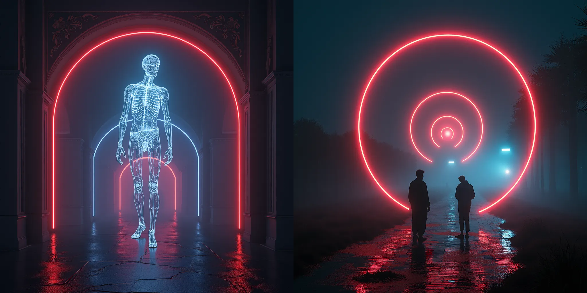
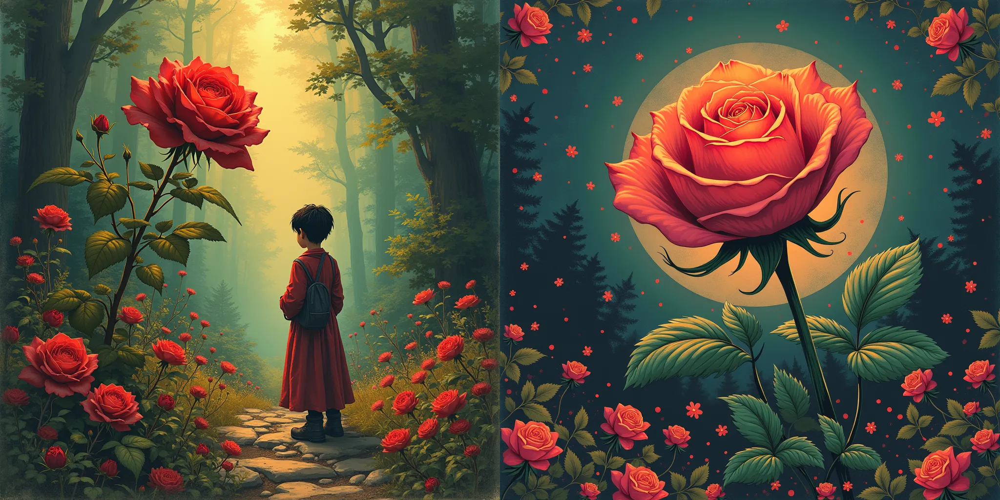
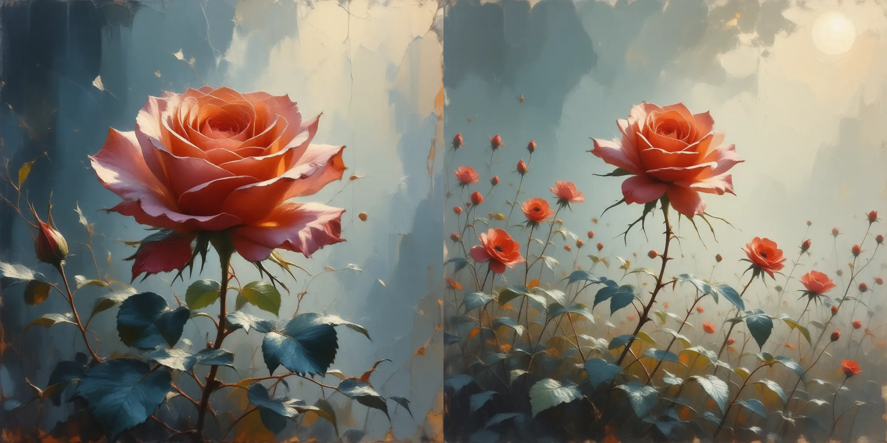
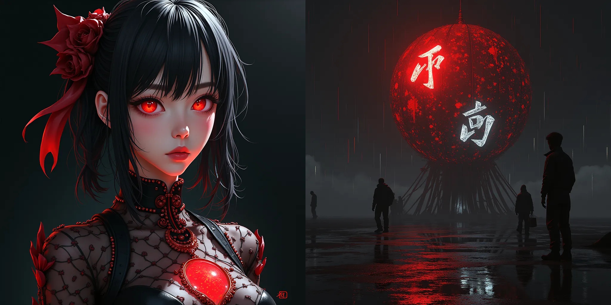
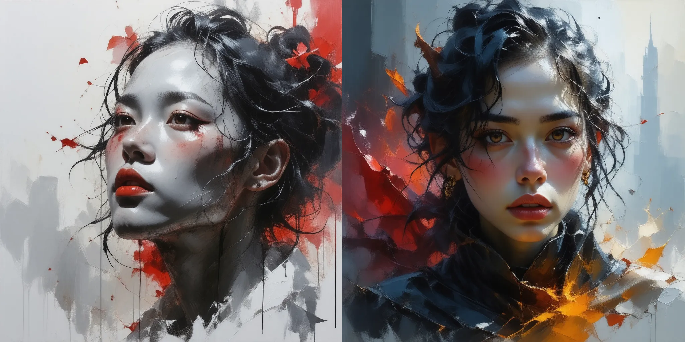

# <p align="center">Simple Prompt Generator</p>
### <p align="center">Simple prompt generation script for Midjourney, DALLe, Stable and Disco diffusion, Flux and etc neural networks.</p><br>
<div  align="center">
    
    <!img style="display: inline-block;" src='https://visitor-badge.glitch.me/badge?page_id=WiNE-iNEFF_HF_Simple_Prompt_Generator&left_text=HuggingFaceVisitors' alt='visitor badge'>
    
</div>  

## <p align="center">Quick start</p>

You can download scripts from this repository and start in command line:
```python
python main.py -p "pr1.txt" -n 5 -a 2
['-p', '--prompts' , Choose between 'pr1.txt'(Prompt Generator v0.1(Better quality)) or 'pr2.txt'(Prompt Generator v0.2(More tags)))]
['-n', '--num' , number of word in prompt (Standart: 10, MAX: 20)]
['-a', '--artists' , How many artists use in prompt (Standart: 2)]
```
or try to use this <a href="https://wine-ineff.github.io/Simple_Prompt_Generator/" target="_blank">website</a>, <a href="https://github.com/WiNE-iNEFF/Simple_Prompt_Generator/releases" target="_blank">app</a>, <a href="https://huggingface.co/spaces/WiNE-iNEFF/HF_Simple_Prompt_Generator" target="_blank">Gradio Demo</a> or <a href="https://github.com/WiNE-iNEFF/Stable_Diffusion_colab" target="_blank">colab notebook</a>

## <p align="center">Update</p>


01.04.23:
- Improved code removed bugs of the last update <br>
19.02.23:
- Update code and text prompts for better experements
- Added the ability to specify the number of artists in the text prompt
- Update website <br>
12.02.23:
- Change the code of the site for more comfortable work both on PC and on the phone
- Delete some bad prompt in Prompt Generator v0.1
- Add [Gradio page](https://huggingface.co/spaces/WiNE-iNEFF/HF_Simple_Prompt_Generator)

## <p align="center">Example</p>

**Version 0.1**:
```
galaxy, art by ismail inceoglu, render, detailed, photorealistic, photorealistic dramatic anime boy, trending on pixiv, full hd, magic circle, landscape, photorealistic, sunsets, flowers, global illumination, block cities, digital painting, mirrors
```

| Model                | Result             |
| -------------------- | ------------------ |
| Flux                 |  |
| Stable Diffusion 3.5 |    |
```
by peter mohrbacher,  hdr, Sunsets, artstation, 4k 3d, by wayne barlowe,  rossdraws global illumination, terragen, hyper detailed, Animal T-Shirt Design, art by atey ghailan, battle field, epic, art by craig mullins, full hd, by craig mullins, Anime / Manga
```

| Model | Result             |
| ----- | ------------------ |
| Flux  |  |
<br>
**Version 0.2**:
```
light painting, art by john kenn mortense, baroque, art nouveau, space, neon, telephoto, cyclic, art by lemma guya, radiant light, light nover, vray render, unreal engine, tornadic
```

| Model                | Result             |
| -------------------- | ------------------ |
| Flux                 |  |
| Stable Diffusion 3.5 |    |
```
"by atey ghailan, cinematic, radiant light, rose, scrapbooking, by peter mohrbacher,  12-bit, flowers, postage stamp, post-apocalypse, character design, art by john Constable, fanbox"
```

| Model                | Result             |
| -------------------- | ------------------ |
| Flux                 |  |
| Stable Diffusion 3.5 |    |
```
fanbox, drawing, 4-bit, wet paint, weta FX, by wlop, art by Ko Young Hoon, art by craig mullins, beautiful lighting, by hajime sorayama,  Octal, puffy paint, volumetric lighting, art by atey ghailan, tones of black, by Ralph Steadman, logo
```

| Model                | Result             |
| -------------------- | ------------------ |
| Flux                 |  |
| Stable Diffusion 3.4 |    |

# <p align="center">For more example going on:</p>
<h3 align="center">
	<a href="https://twitter.com/wine_ineff" target='_blank'>Twitter</a><br>
	<a href="https://www.instagram.com/wine_ineff" target='_blank'>Instagram</a><br>
	<a href="https://www.reddit.com/user/WiNE-iNEFF" target='_blank'>Reddit</a>
</h3>

## <p align="center">Development support</p>
If you want to support this project and author of this project:

| TON          | UQDXHLtVLfeMsUjk_XtvgEC6CYxo63ZkLOrrFlaAe2cGn3-Z |
| ------------ | ------------------------------------------------ |
| BTC          | 3KhWEKA2LpGeesshPCfgRRLsZuBHFtCnfU               |
| USDT (TRC20) | TGfzwpq2FhQbWisZMWyY98h2KgqV2JVjFH               |


